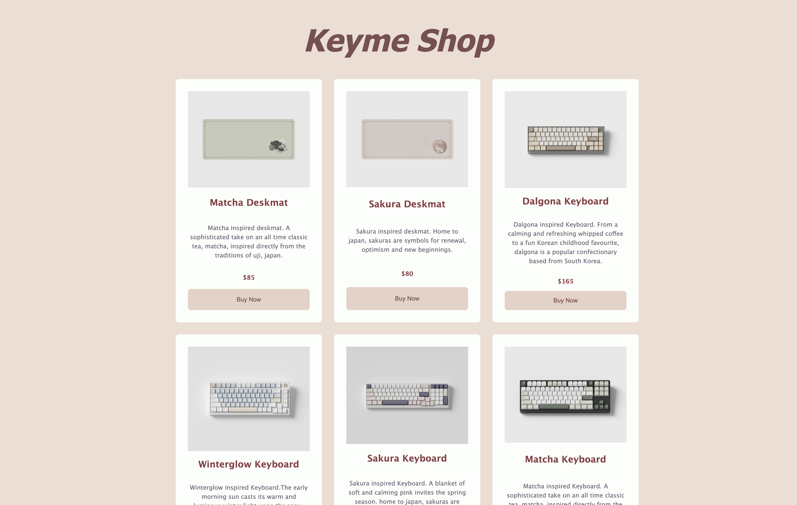

# Project Online Shop - 'Keyme Shop'

## Overview

Are you bored of boring simple keyboards that collect dust at your desk?

Well here at Keyme Shop we sell the most sophisticated tech here, with beautifully crafted keyboards that will bring you comfort and joy to your desk.

Using the latest generation of cherry profile molds and sourcing only pure PBT plastic, our keycaps achieve a smooth and consistent feel.

Our design that's uniquely Keyme. with a friendly yet sophisticated typeface that's both equally beautiful and equally legible.

These products are made to last! Come get your beautifully crafted keyboards at Keyme Shop today!

## Features

- Responsive Website - this online shop is supported across mobile, tablet and desktop screen sizes
- Built using ReactJS
- Stripe has been integrated for product management as well as checkout

## Dependencies

This project uses the following systems to run properly.

- [ReactJS](https://legacy.reactjs.org/) - front-end framework
- [Stripe](https://stripe.com/en-nz) - payment processing network
- [Begin](https://begin.com/) - API manager

## Prerequisites

- Make sure [Node](https://nodejs.org/en) 18+ is installed

## Local Development

1. Run `npm install`
2. Run `npm start` to open the development server
3. Open `src/App.js`

## Deployed Application

Open the deployed application here at:
https://react-online-shop-keyme-shop.onrender.com
